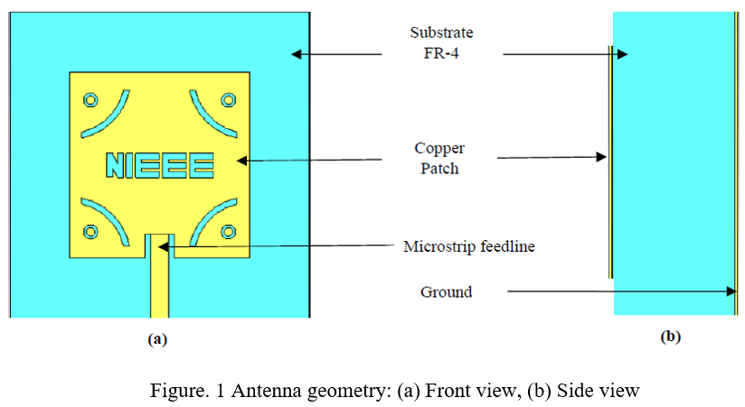

# Dual-Band Metamaterial-Backed Patch Antenna (2.2 GHz / 5.8 GHz)

## 📌 Overview
Design, simulation, fabrication, and measurement of a high-efficiency metamaterial-backed microstrip patch antenna targeting Sub-6 GHz wireless applications.

---

## 📊 Performance Summary

| Parameter                  | 2.2 GHz Band        | 5.8 GHz Band        |
|--------------------------|--------------------|--------------------|
| Resonant Frequency       | 2.204 GHz (sim)    | 5.851 GHz (sim)    |
| S11 (Simulated)          | -24.08 dB          | -43.34 dB          |
| S11 (Measured)           | -6.08 dB           | -29.00 dB          |
| Bandwidth (Simulated)    | 190 MHz            | 400 MHz            |
| Bandwidth (Measured)     | 160 MHz            | 320 MHz            |
| Gain                     | 3.82 dBi           | 5.01 dBi           |
| Directivity              | 4.97 dBi           | 5.59 dBi           |
| Radiation Efficiency     | ~75–98%            | ~89–99.87%         |

---

## 🎯 Key Achievements
- Achieved **dual-band operation on lossy FR-4 substrate**
- **Radiation efficiency exceeding 98%** at target frequencies :contentReference[oaicite:0]{index=0}
- Bandwidth improved from **320 MHz → 870 MHz** with metamaterial integration :contentReference[oaicite:1]{index=1}
- Demonstrated strong agreement between simulation and measurement

---

## 🧩 Design Highlights
- Substrate: FR-4 (εr = 4.3, tanδ = 0.025)
- Patch Size: ~30 × 30 mm²
- Metamaterial: 5×5 SRR-based array
- Feeding: 50Ω microstrip line
- Slot: NIEEE-shaped for dual resonance

---

## 📈 Key Engineering Insights
- Metamaterial layer:
  - Suppresses surface waves
  - Enhances forward radiation at 5.8 GHz
  - Improves impedance matching
- Trade-off observed:
  - Gain suppression at 2.2 GHz due to MTM interaction

---

## 📷 Figures:

---

---

---

## 🚀 Applications
WLAN | IoT | Sub-6 GHz 5G | RFID
