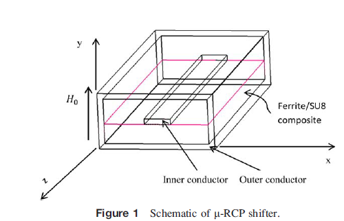
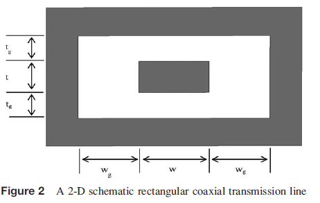
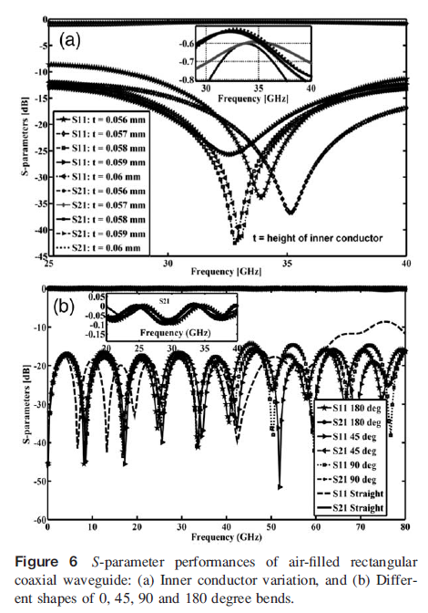
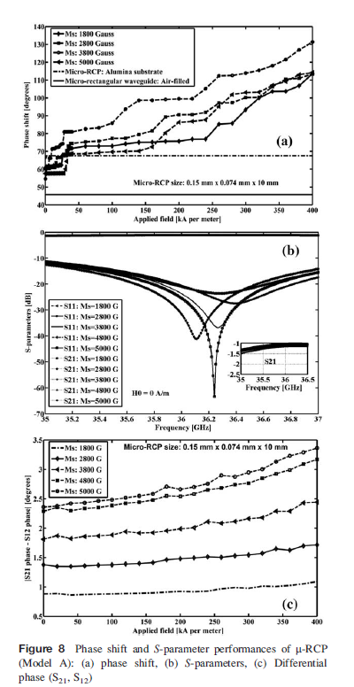
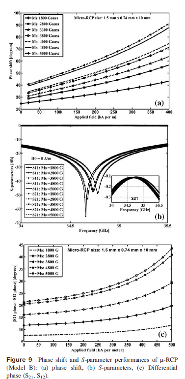

# Micro-Rectangular Coaxial Ferrite Phase Shifter (Ka-Band)

## 📌 Overview
Design and simulation of a tunable ferrite-based micro-rectangular coaxial phase shifter for microwave and phased-array applications.

---

## 📊 Performance Summary

| Parameter                  | Value                          |
|--------------------------|--------------------------------|
| Frequency Range          | 33 – 36.5 GHz                  |
| Phase Shift (Model A)    | ~60°/cm                        |
| Phase Shift (Model B)    | ~20°/cm                        |
| Max Phase Shift          | ~88°/cm                        |
| Return Loss              | < -20 dB                       |
| Insertion Loss           | < 1 – 1.5 dB                   |
| Differential Phase       | Up to ~22°                     |

---

## 🎯 Key Achievements
- Developed **novel micro-rectangular coaxial phase shifter architecture**
- Achieved **low insertion loss (<1 dB)** :contentReference[oaicite:2]{index=2}
- Demonstrated **field-controlled tunable phase shift**
- Enabled **nonreciprocal operation for phased arrays**

---

## 🧩 Design Highlights
- Structure: Rectangular coaxial waveguide
- Material: Strontium ferrite-SU8 composite
- Simulation Tool: HFSS
- Bias Field: 0–400 kA/m

---

## 📈 Engineering Insights
- Ferrite introduces **field-dependent phase tuning**
- Geometry enables **TEM mode propagation**
- Scaled model improves nonreciprocal behavior

---

## 📷 Figures

---

## 🚀 Applications
Phased Arrays | Radar Systems | Beam Steering | Microwave Systems
